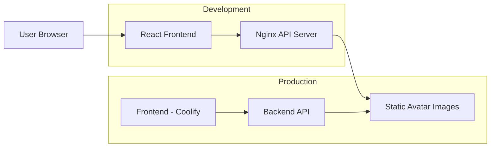

# Avatar Letter

A unified full-stack application providing beautiful 3D-ish, stylish avatar letter images through a simple API.

## 🎯 Project Overview

This project combines a React frontend with an nginx-based API server to deliver high-quality avatar letter images. The images are perfect for profile photo placeholders, offering a variety of sets, sizes, and formats - all for free!

**Example Images:**


*Set 1: 3D-ish looking avatar letters*


*Set 2: Cool, stylish avatar letters*

## 🏗️ Architecture



### Services

- **Frontend**: React + Vite application with hot-reload in development
- **Backend API**: Nginx server with rate limiting serving static avatar images
- **Network**: Both services communicate via Docker bridge network

## 🚀 Quick Start

### Prerequisites

- Docker and Docker Compose installed
- pnpm (for local development without Docker)

### Development Environment

**Windows:**
```cmd
scripts\dev.bat
```

**Linux/Mac:**
```bash
bash scripts/dev.sh
```

This will start:
- Frontend dev server at `http://localhost:5173`
- Backend API server at `http://localhost:8080`

### Production Testing (Local)

**Windows:**
```cmd
scripts\prod-local.bat
```

**Linux/Mac:**
```bash
bash scripts/prod-local.sh
```

This will start:
- Frontend production build at `http://localhost:3000`
- Backend API server at `http://localhost:8080`

### Stop Services

**Windows:**
```cmd
scripts\stop.bat
```

**Linux/Mac:**
```bash
bash scripts/stop.sh
```

## 📋 Setup Instructions

### First Time Setup

1. **Clone the repository**
   ```bash
   git clone <repository-url>
   cd avatar-letter-client
   ```

2. **Install dependencies (optional, for local development)**
   ```bash
   pnpm install
   ```

3. **Copy environment file**
   ```bash
   cp .env.example .env
   ```

4. **Start development environment**
   ```bash
   bash scripts/dev.sh
   ```

### Port Mappings

| Service | Environment | Port | URL |
|---------|-------------|------|-----|
| Frontend | Development | 5173 | http://localhost:5173 |
| Frontend | Production (Local) | 3000 | http://localhost:3000 |
| Backend API | All | 8080 | http://localhost:8080 |

## 🔧 Development Workflow

### Using pnpm (Local Development)

```bash
# Install dependencies
pnpm install

# Run development server
pnpm run dev

# Build for production
pnpm run build

# Preview production build
pnpm run preview

# Lint code
pnpm run lint

# Format code
pnpm run format
```

### Using Docker (Recommended)

Development with hot-reload:
```bash
bash scripts/dev.sh
```

The frontend will automatically reload when you make changes to the source code.

## 🚀 Production Deployment

### Coolify Deployment (Frontend)

The frontend is deployed to Coolify. The production nginx configuration includes a proxy to forward `/api/*` requests to the backend service.

**Important**: Update the nginx proxy configuration in production to point to your deployed backend API URL.

### Backend API Deployment

Deploy the backend API service:

```bash
bash scripts/prod.sh
```

This starts only the backend API service in detached mode. The frontend is deployed separately on Coolify.

## 📡 API Documentation

### Base URL

- **Development**: `http://localhost:8080`
- **Production**: Configure based on your deployment

### Endpoints

#### Get Avatar Image

```
GET /api/file/{set}/{size}/{letter}/{format}
```

**Parameters:**

| Parameter | Type | Description | Options |
|-----------|------|-------------|---------|
| `set` | string | Avatar set style | `set1`, `set2` |
| `size` | string | Image dimensions | `tiny` (24px), `small` (32px), `med` (48px), `big` (64px), `large` (128px), `full` (225px) |
| `letter` | string | Letter to display | `a-z` (case insensitive) |
| `format` | string | Image format | `png`, `webp` |

**Example Requests:**

```bash
# Get set1, big size, letter 'a', PNG format
curl http://localhost:8080/api/file/set1/big/a/png

# Get set2, large size, letter 'b', WebP format
curl http://localhost:8080/api/file/set2/large/b/webp

# Get set1, small size, letter 'z', PNG format
curl http://localhost:8080/api/file/set1/small/z/png
```

**Response:**
- Success: Returns the image file
- Not Found: `404 - Image not found`
- Rate Limited: `429 - Rate limit exceeded. Please try again later.`

#### Health Check

```
GET /health
```

Returns `200 OK` if the service is healthy.

### Rate Limiting

The API implements rate limiting to prevent abuse:

- **Limit**: 100 requests per minute per IP address
- **Burst**: Up to 20 requests can burst temporarily
- **Response**: Returns `429 Too Many Requests` when limit exceeded

### CORS

CORS is enabled for all origins, allowing the API to be used from any domain.

## 📜 Helper Scripts

All scripts are available in both Unix shell (`.sh`) and Windows batch (`.bat`) formats.

### Available Scripts

| Script | Purpose |
|--------|---------|
| `dev.sh` / `dev.bat` | Start development environment with hot-reload |
| `prod-local.sh` / `prod-local.bat` | Test production build locally |
| `prod.sh` / `prod.bat` | Deploy backend API for production |
| `stop.sh` / `stop.bat` | Stop all running services |

### Script Details

**Development (`dev.sh`)**
- Starts both frontend and backend services
- Enables hot-reload for frontend
- Uses Docker Compose profile: `dev`

**Production Local (`prod-local.sh`)**
- Builds and runs production versions of both services
- Useful for testing before deployment
- Uses Docker Compose profile: `prod-local`

**Production (`prod.sh`)**
- Starts only the backend API service
- Runs in detached mode
- Frontend is deployed separately on Coolify

**Stop (`stop.sh`)**
- Stops all running Docker containers
- Cleans up Docker Compose resources

## 🌐 Coolify Deployment Notes

### Frontend Deployment

The frontend is deployed to Coolify with the following configuration:

1. **Build Command**: `pnpm install && pnpm run build`
2. **Start Command**: Uses nginx to serve static files
3. **Environment Variables**: Configure `VITE_API_URL` to point to your backend API

### Backend API Deployment

The backend can be deployed separately or alongside the frontend:

1. **Dockerfile**: Uses `Dockerfile.api`
2. **Port**: Expose port 80 internally
3. **Health Check**: `/health` endpoint

### Nginx Configuration for Production

Update the frontend's `nginx.conf` to proxy API requests to your deployed backend:

```nginx
location /api/ {
    proxy_pass http://your-backend-api-url;
    # ... other proxy settings
}
```

## 🐛 Troubleshooting

### Hot Reload Not Working in Docker

If hot reload doesn't work in development:

1. The `vite.config.ts` already includes `usePolling: true`
2. Ensure Docker has proper file system access
3. Try restarting the containers: `bash scripts/stop.sh && bash scripts/dev.sh`

### Port Already in Use

If you get a port conflict error:

1. Check what's using the port: `netstat -ano | findstr :5173` (Windows) or `lsof -i :5173` (Linux/Mac)
2. Stop the conflicting service or change the port in `docker-compose.yml`

### TypeScript Errors

If you encounter TypeScript errors:

1. Ensure all dependencies are installed: `pnpm install`
2. Clear the TypeScript cache: `rm -rf node_modules/.tmp`
3. Restart your IDE/editor

### Cannot Connect to Backend API

1. Verify backend is running: `curl http://localhost:8080/health`
2. Check Docker network: `docker network ls`
3. Verify services are on the same network: `docker network inspect avatar-letter-client_avatar-network`

### Rate Limit Issues

If you're hitting rate limits during development:

1. The limit is 100 requests/minute per IP
2. Adjust in `nginx-api.conf`: Change `rate=100r/m` to a higher value
3. Rebuild the backend: `docker compose up backend-api --build`

## 📝 Credits

The avatar images were downloaded from Freepik and modified:

- **Set 1**: [pikisuperstar](https://www.freepik.com/free-vector/colorful-alphabet_958008.htm)
- **Set 2**: [Sapann-Design](https://www.freepik.com/free-vector/hand-drawn-colorful-alphabet_2920859.htm)

Images were edited in PowerPoint and processed using the Sharp library for resizing, compression, and format conversion.

## 📄 License

This project is private. All rights reserved.

## 👤 Author

**Yatrik Patel**

---

**Made with ❤️ for better avatar placeholders**
