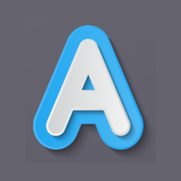
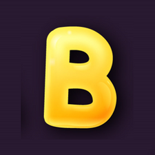
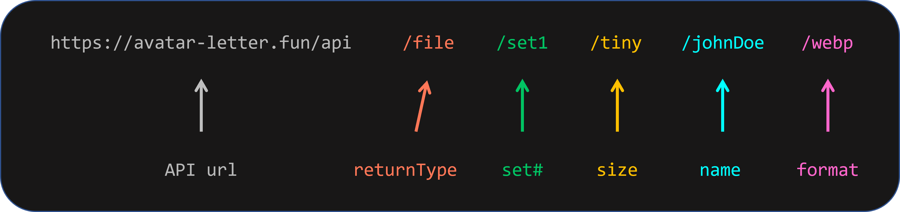

# Avatar Letter

A 3D-ish, stylish, cool, or unique-looking avatar-letter!

## Why I made this

I made this to use in another app I'm working on so I don't have to rely on other Avatar libraries or providers, or maybe just for fun.

The idea is to return a beautiful 3D-ish, stylish, cool, or unique-looking letter's image to the user rather than the default ones we see in most applications while making sure to provide a variety of sizes, sets (2 for now), and formats (2 for now) for free.

**_Here's an example image of what will be returned by set1 of avatar-letter:_**

**_Here's an example image of what will be returned by set2 of avatar-letter:_**

**_Images of what most other avatar-letter libraries, sites, etc. return:_**

The images were edited in PowerPoint initially after downloading from Freepik first. The images were then resized, compressed, and saved in other formats using the Sharp library. It's crazy how sharp can save hundreds of images on your device in a split of a second.

As far as creating, updating, or deleting any sets, sizes, or formats (basically the static images found in public/letters folder) is concerned, I'd like to be the one maintaining that right now. I will consider ideas for improvement, or ideas for expanding this and providing users with more options

## How to use this/How to Get Started?

To use this in your project, the steps are simple:

1. Simply add the following url as the src attribute in your img tags:
   https://avatar-letter.fun/api/file/set1/tiny/a/png

2. Modify the url as per your needs.

## Here's a breakdown of the url:

### The complete url looks like the following:

> https://avatar-letter.fun/api/file/set1/big/a/png

### What options or params can I pass in?

| returnType | file (may add more option like returning binary data or may completely remove this) |
| set# | set1, or set2 (for now) |
| size | tiny (24px), small (32px), med (48px), big (64px), large (128px), full (225px) |
| name | a-z or A-Z only (will find first matching alphabet and return that alphabet's image) |
| format | png or webp |

### Credits

The images were downloaded from Freepik and later modified. Here are the direct links:

- Set 1: [pikisuperstar](https://www.freepik.com/free-vector/colorful-alphabet_958008.htm)

- Set 2: [Sapann-Design](https://www.freepik.com/free-vector/hand-drawn-colorful-alphabet_2920859.htm)
